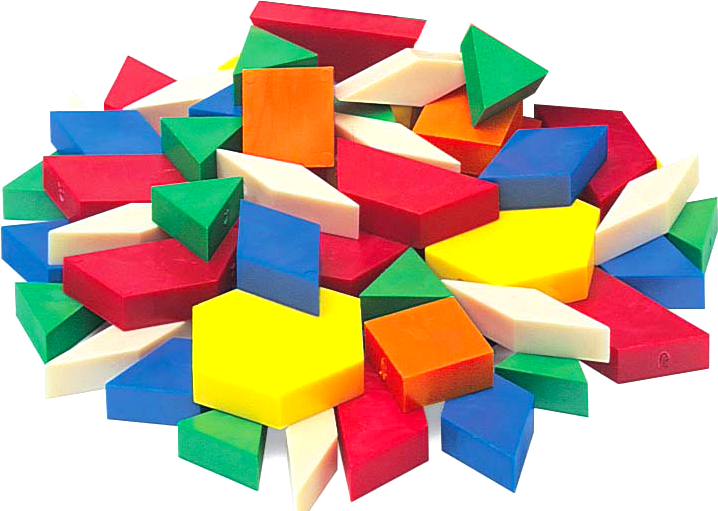

# Tangram Blocks

Gallery of **reusable building blocks for Tangram** to make beautiful maps simpler.

Writing custom styles for [Tangram](https://mapzen.com/projects/tangram/) can be tricky because you need to know some GL Shading Language, but using this 
library for recipes, you can mix and reuse some of the snippets of shader code blocks that flavor our maps.

## How to use them?
<hr>

So first you need to `import` the block to the [YAML scene file](https://mapzen.com/documentation/tangram/Scene-file/) you are working on. That will look something like this:

```yaml
import:
    - https://tangrams.github.io/blocks/filter/grain.yaml
```

Then you need to ```mix``` it with the custom styles of your choise. For example:

```yaml
styles:
    buildings:
        base: polygons
        mix: [filter-grain]
```

Some of the blocks like [points](#points), [lines](#lines), [polygons](#polygons), [fx](#fx) and [filter](#filter) automatically will add the necessary lines to the `normals`, `color` and `filter` blocks to make it work. So you don't have to do anything else other than add it to the `mix:`. Then you can tweak the values from the ```defines``` to your own prefernces. For example in the above example we can increase the detail and amount of the grain by modifying these two defines:

```yaml
styles:
    buildings:
        base: polygons
        mix: [filter-grain]
        shaders:
            defines:
                GRAIN_AMOUNT: .4
                NUM_OCTAVES: 3
```

The rest of the building blocks just provide reusable GLSL functions into the `global` shader block. 

To learn basic principles about shaders we recomend reading [The Book of shaders](http://thebookofshaders.com/), if you are interested to learn about [shaders inside Tangram read tangram documentation about that subject](https://mapzen.com/documentation/tangram/Shaders-Overview/).

## Want to contribute?

If you have made a nice shader style you are proud of and want to share it, send me an email to <patricio@mapzen.com> or a DM to [@patriciogv](https://twitter.com/patriciogv) and I will be happy to help you make a **block** out of it. 
