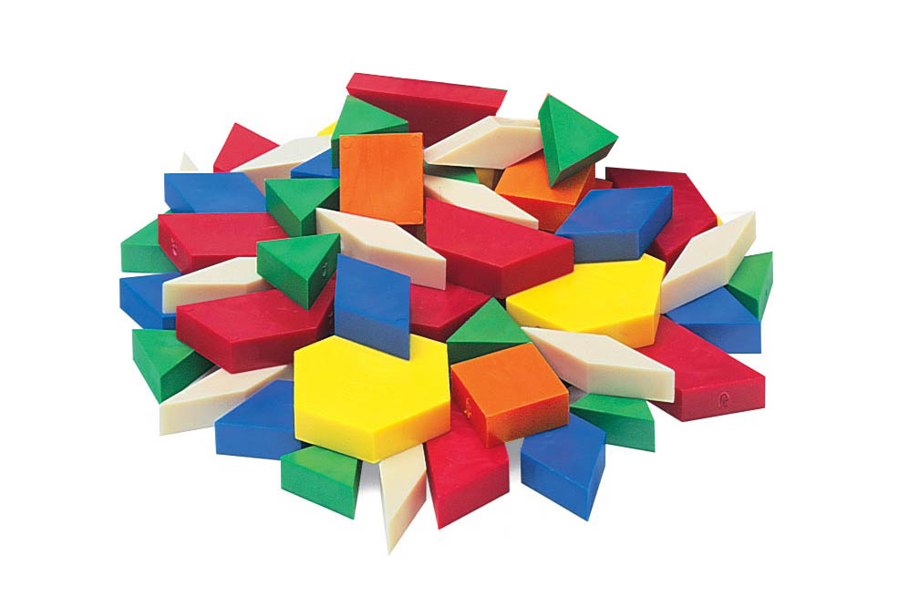

# Tangram Blocks

Set of reusable building blocks for Tangram to make beatifull maps. Is in esence a library of our own Tangram recipes. A simpler way to add new GSLS Shaders features into your maps.

## How to use them?
<hr>

In your style add a path to it, like this:

```yaml
import:
    - https://tangrams.github.io/blocks/filter/grain.yaml
```

Then ```mix``` it with your custom styles like this:

```yaml
styles:
    buildings:
        base: polygons
        mix: [filter-grain]
```

This will add all the functions defined on that **Tangram Block** to your current custom style (in this case ```buildings```). Note that some of this modules have some values on the ```defines``` that can be tweaked. For example in the above example we can increase the detail and amount of the grain by modifying this two defines:

```yaml
styles:
    buildings:
        base: polygons
        mix: [filter-grain]
        shaders:
            defines:
                GRAIN_AMOUNT: .4
                NUM_OCTAVES: 3
```

## Blocks description
<hr>


### [COLOR](https://github.com/tangrams/blocks/tree/gh-pages/color)

#### [color-conversion](https://github.com/tangrams/blocks/blob/gh-pages/color/conversion.yaml)

Set of functions to convert colors between color systems/spaces.
For more information on this theme read [this chapter of The Book of Shaders about color](http://thebookofshaders.com/06/).


Import using:

```yaml
import:
    - https://tangrams.github.io/blocks/color/conversion.yaml
```


This blocks use a custom **shader**.These are the **shader blocks**:

- **global**:
 + `vec3 rgb2hsb (vec3 c) `
 + `vec3 rgb2hsb (vec4 c) `
 + `vec3 hsb2rgb (vec3 c) `


#### [color-palette](https://github.com/tangrams/blocks/blob/gh-pages/color/palette.yaml)

Procedural generation of color paletters implemented by [Inigo Quiles](https://twitter.com/iquilezles) (1999) explained in [this article](http://www.iquilezles.org/www/articles/palettes/palettes.htm)


Import using:

```yaml
import:
    - https://tangrams.github.io/blocks/color/palette.yaml
```


This blocks use a custom **shader**.These are the **shader blocks**:

- **global**:
 + `vec3 palette (float t, vec3 a, vec3 b, vec3 c, vec3 d) `


#### [color-tools](https://github.com/tangrams/blocks/blob/gh-pages/color/tools.yaml)

Set of color tools to get the **intensity** and **brightness** of a color.
For more information on this theme read [this chapter of The Book of Shaders about color](http://thebookofshaders.com/06/).


Import using:

```yaml
import:
    - https://tangrams.github.io/blocks/color/tools.yaml
```


This blocks use a custom **shader**.These are the **shader blocks**:

- **global**:
 + `float getIntensity (vec3 c) `
 + `float getIntensity (vec4 c) `
 + `float getBrightness (vec3 c) `
 + `float getBrightness (vec4 c) `


### [ELEVATION](https://github.com/tangrams/blocks/tree/gh-pages/elevation)

#### [elevation-normal](https://github.com/tangrams/blocks/blob/gh-pages/elevation/normal.yaml)

When a raster normalmap tiles source is load like:
```
    normals-elevation:
        type: Raster
        url: https://s3.amazonaws.com/elevation-tiles-prod/normal/{z}/{x}/{y}.png
        max_zoom: 15
```
Use it to apply the normalmap and let the lighting system do the rest


Import using:

```yaml
import:
    - https://tangrams.github.io/blocks/elevation/normal.yaml
```


This blocks use a custom **shader**.These are the defaults **defines**:
 - **NORMAL_TEXTURE_INDEX**: ```0```

These are the **shader blocks**:

- **normal**:

```glsl
vec4 normal_elv_raster = sampleRaster(int(NORMAL_TEXTURE_INDEX));
normal = (normal_elv_raster.rgb-.5)*2.;
```


#### [elevation-ramp](https://github.com/tangrams/blocks/blob/gh-pages/elevation/ramp.yaml)


Import using:

```yaml
import:
    - https://tangrams.github.io/blocks/elevation/ramp.yaml
```


This blocks use a custom **shader**.This are the **uniforms**:
 - **u_ramp**: ```data:image/png;base64,iVBORw0KGgoAAAANSUhEUgAAAAwAAAABCAYAAADq6085AAAMGGlDQ1BJQ0MgUHJvZmlsZQAASImVlwdUU0kXx+eVFEJCC0RASuhNkF6l9yIgHWyEJEAoMQSCih1ZVHAtqIhgRVdAbGsBZFERUSwsgr1vLKgo62LBhso3SQBd9yvnu+fMe7/cuXPnP5OZd2YAULRnCQRZqBIA2fw8YVSgDzMhMYlJEgME4IAM7IATi50r8I6MDAPQRt9/t3fXYTS0K5aSXP+s/6+mzOHmsgFAIiGncHLZ2ZCPAIBrsgXCPAAI3dBvMDtPIOG3kFWFUCAARLKE02SsJeEUGVtLY2KifCH7AUCmsljCNAAUJPmZ+ew0mEdBANmaz+HxIW+H7MFOZ3EgiyFPyM6eBVmRCtk05bs8aX/LmTKWk8VKG2PZWKRG9uPlCrJYc//P6fjflp0lGu1DHxZqujAoSjJmOG+1mbNCJQy1Iy38lPAIyCqQz/E40ngJ304XBcWOxPezc33hnAEGACjgsPxCIcO5RBmizFjvEbZlCaVtYTwazssLjhnhFOGsqJH8aD4/KzxsJM/ydG7wKG/l5vpHj8ak8gKCIcOVhh4pSI+Jl+lE2/N5ceGQFSB352ZGh460vV+Q7hs+GiMURUk0G0J+myoMiJLFYOrZuaPjwqzYLGlf6pC98tJjgmRtsQRubkLYqAYO189fpgHjcPmxI9owuLp8okbaFguyIkfisa3crMAo2TxjB3Pzo0fbXs6DC0w2D9jDDFZIpEw/9k6QFxkj04bjIAz4Aj/ABCJYUsAskAF4Xf2N/fCXrCYAsIAQpAEusBzxjLaIl9bw4TMaFIA/IXFB7lg7H2ktF+RD/5cxr+xpCVKltfnSFpngCeRsXBP3wN3wMPj0gsUWd8ZdRtsxFUd7JfoT/YhBxACi2ZgONlSdBYsQ8P6NLxS+uXB0Ei380TF8y0d4QughPCRcI4gJt0AceCzNMhI1k1co/EE5E0wGYpgtYGR0KTBn32gMbgxVO+A+uDvUD7XjDFwTWOL2cCTeuCccmwP0fq9QNKbt21z+2J9E9ffjGfErmCs4jKhIGftnfMeifszi+90cceA79MdIbDl2GOvATmHnsRasETCxk1gT1okdl/DYSngsXQmjvUVJtWXCPLzRGOt66z7rz//onTWiQCj9v0Eed06eZEP4zhLMFfLS0vOY3vCLzGUG89lWE5i21jaOAEi+77LPxxuG9LuNMC588+W0AuBSAp1p33wsAwCOPQGA/u6bz+A13F5rADjezRYJ82U+XPIgAApQhDtDA+gAA2AKx2QLHIEb8AL+IAREgBiQCGbAWU8H2VD1bDAfLAHFoBSsARtAJdgGdoJasA8cAo2gBZwCZ8FF0A2ugTtwbfSCF2AAvANDCIKQEBpCRzQQXcQIsUBsEWfEA/FHwpAoJBFJRtIQPiJC5iNLkVKkDKlEdiB1yK/IMeQUch7pQW4hD5A+5DXyCcVQKqqKaqPG6ETUGfVGQ9EYdDqahuagBWgRugqtQKvRvWgDegq9iF5DxegLdBADmDzGwPQwS8wZ88UisCQsFRNiC7ESrByrxvZjzfC/voKJsX7sI07E6TgTt4TrMwiPxdl4Dr4QX4lX4rV4A96OX8Ef4AP4VwKNoEWwILgSggkJhDTCbEIxoZywm3CUcAbunV7COyKRyCCaEJ3g3kwkZhDnEVcStxAPEFuJPcRHxEESiaRBsiC5kyJILFIeqZi0ibSXdJJ0mdRL+kCWJ+uSbckB5CQyn1xILifvIZ8gXyY/JQ/JKckZybnKRchx5ObKrZbbJdcsd0muV26IokwxobhTYigZlCWUCsp+yhnKXcobeXl5fXkX+SnyPPnF8hXyB+XPyT+Q/0hVoZpTfanTqCLqKmoNtZV6i/qGRqMZ07xoSbQ82ipaHe007T7tgwJdwUohWIGjsEihSqFB4bLCS0U5RSNFb8UZigWK5YqHFS8p9ivJKRkr+SqxlBYqVSkdU7qhNKhMV7ZRjlDOVl6pvEf5vPIzFZKKsYq/CkelSGWnymmVR3SMbkD3pbPpS+m76GfovapEVRPVYNUM1VLVfapdqgNqKmr2anFqc9Sq1I6riRkYw5gRzMhirGYcYlxnfBqnPc57HHfcinH7x10e9159vLqXOle9RP2A+jX1TxpMDX+NTI21Go0a9zRxTXPNKZqzNbdqntHsH6863m08e3zJ+EPjb2uhWuZaUVrztHZqdWoNautoB2oLtDdpn9bu12HoeOlk6KzXOaHTp0vX9dDl6a7XPan7nKnG9GZmMSuY7cwBPS29ID2R3g69Lr0hfRP9WP1C/QP69wwoBs4GqQbrDdoMBgx1DScbzjesN7xtJGfkbJRutNGow+i9sYlxvPEy40bjZybqJsEmBSb1JndNaaaepjmm1aZXzYhmzmaZZlvMus1RcwfzdPMq80sWqIWjBc9ii0XPBMIElwn8CdUTblhSLb0t8y3rLR9YMazCrAqtGq1eTjScmDRx7cSOiV+tHayzrHdZ37FRsQmxKbRptnlta27Ltq2yvWpHswuwW2TXZPfK3sKea7/V/qYD3WGywzKHNocvjk6OQsf9jn1Ohk7JTpudbjirOkc6r3Q+50Jw8XFZ5NLi8tHV0TXP9ZDrX26Wbplue9yeTTKZxJ20a9Ijd313lvsOd7EH0yPZY7uH2FPPk+VZ7fnQy8CL47Xb66m3mXeG917vlz7WPkKfoz7vfV19F/i2+mF+gX4lfl3+Kv6x/pX+9wP0A9IC6gMGAh0C5wW2BhGCQoPWBt0I1g5mB9cFD4Q4hSwIaQ+lhkaHVoY+DDMPE4Y1T0Ynh0xeN/luuFE4P7wxAkQER6yLuBdpEpkT+dsU4pTIKVVTnkTZRM2P6oimR8+M3hP9LsYnZnXMnVjTWFFsW5xi3LS4urj38X7xZfHihIkJCxIuJmom8hKbkkhJcUm7kwan+k/dMLV3msO04mnXp5tMnzP9/AzNGVkzjs9UnMmaeTiZkByfvCf5MyuCVc0aTAlO2ZwywPZlb2S/4Hhx1nP6uO7cMu7TVPfUstRnae5p69L60j3Ty9P7eb68St6rjKCMbRnvMyMyazKHs+KzDmSTs5Ozj/FV+Jn89lk6s+bM6hFYCIoF4hzXnA05A8JQ4e5cJHd6blOeKjzqdIpMRT+JHuR75Fflf5gdN/vwHOU5/Dmdc83nrpj7tCCg4Jd5+Dz2vLb5evOXzH+wwHvBjoXIwpSFbYsMFhUt6l0cuLh2CWVJ5pLfC60LywrfLo1f2lykXbS46NFPgT/VFysUC4tvLHNbtm05vpy3vGuF3YpNK76WcEoulFqXlpd+XsleeeFnm58rfh5elbqqa7Xj6q1riGv4a66v9VxbW6ZcVlD2aN3kdQ3rmetL1r/dMHPD+XL78m0bKRtFG8UVYRVNmww3rdn0uTK98lqVT9WBzVqbV2x+v4Wz5fJWr637t2lvK932aTtv+80dgTsaqo2ry3cSd+bvfLIrblfHL86/1O3W3F26+0sNv0ZcG1XbXudUV7dHa8/qerReVN+3d9re7n1++5r2W+7fcYBxoPQgOCg6+PzX5F+vHwo91HbY+fD+I0ZHNh+lHy1pQBrmNgw0pjeKmxKbeo6FHGtrdms++pvVbzUtei1Vx9WOrz5BOVF0YvhkwcnBVkFr/6m0U4/aZrbdOZ1w+mr7lPauM6Fnzp0NOHu6w7vj5Dn3cy3nXc8fu+B8ofGi48WGTofOo787/H60y7Gr4ZLTpaZul+7mnkk9Jy57Xj51xe/K2avBVy9eC7/Wcz32+s0b026Ib3JuPruVdevV7fzbQ3cW3yXcLbmndK/8vtb96j/M/jggdhQff+D3oPNh9MM7j9iPXjzOffy5t+gJ7Un5U92ndc9sn7X0BfR1P5/6vPeF4MVQf/Gfyn9ufmn68shfXn91DiQM9L4Svhp+vfKNxpuat/Zv2wYjB++/y3439L7kg8aH2o/OHzs+xX96OjT7M+lzxRezL81fQ7/eHc4eHhawhCzpUQCDBU1NBeB1DQC0RHh2gPc4ioLs/iU1RHZnlBL4Tyy7o0kNnlxqvACIXQxAGDyjbIXFCDIVviXH7xgvgNrZjZURy021s5XlosJbDOHD8PAbbQBIzQB8EQ4PD20ZHv6yC4q9BUBrjuzeJzEiPONv15BQ5w0l8KP9C+GVbIQCrHPVAAAACXBIWXMAAA9hAAAPYQGoP6dpAAABWWlUWHRYTUw6Y29tLmFkb2JlLnhtcAAAAAAAPHg6eG1wbWV0YSB4bWxuczp4PSJhZG9iZTpuczptZXRhLyIgeDp4bXB0az0iWE1QIENvcmUgNS40LjAiPgogICA8cmRmOlJERiB4bWxuczpyZGY9Imh0dHA6Ly93d3cudzMub3JnLzE5OTkvMDIvMjItcmRmLXN5bnRheC1ucyMiPgogICAgICA8cmRmOkRlc2NyaXB0aW9uIHJkZjphYm91dD0iIgogICAgICAgICAgICB4bWxuczp0aWZmPSJodHRwOi8vbnMuYWRvYmUuY29tL3RpZmYvMS4wLyI+CiAgICAgICAgIDx0aWZmOk9yaWVudGF0aW9uPjE8L3RpZmY6T3JpZW50YXRpb24+CiAgICAgIDwvcmRmOkRlc2NyaXB0aW9uPgogICA8L3JkZjpSREY+CjwveDp4bXBtZXRhPgpMwidZAAAAPElEQVQIHQExAM7/AeDbyP/s9fQAs7nBAN7a3QD19/UA6ebrABYMCQBAPz0ANTY5ACgpKgAPERgA/gIEAJWEE/iKNZkEAAAAAElFTkSuQmCC```

These are the **shader blocks**:

- **color**:

```glsl
color = texture2D(u_ramp,vec2((1.-normal_elv_raster.a),.5));
```


#### [elevation-stripes](https://github.com/tangrams/blocks/blob/gh-pages/elevation/stripes.yaml)


Import using:

```yaml
import:
    - https://tangrams.github.io/blocks/elevation/stripes.yaml
```


This blocks use a custom **shader**.These are the defaults **defines**:
 - **NORMAL_TEXTURE_INDEX**: ```0```
 - **STRIPES_SCALE**: ```2.0```
 - **STRIPES_ALPHA**: ```0.5```
 - **STRIPES_OUT**: ```13.0```
 - **STRIPES_DIR**: ```vec3(-0.600,-0.420,0.600)```
 - **STRIPES_PCT**: ```1.6```
 - **STRIPES_MAX_ZOOM**: ```13.0```
 - **STRIPES_IN**: ```0.0```

These are the **shader blocks**:

- **color**:

```glsl
float stripes_pct = clamp(smoothstep(STRIPES_IN/STRIPES_MAX_ZOOM, STRIPES_OUT/STRIPES_MAX_ZOOM, max(u_map_position.z/STRIPES_MAX_ZOOM,0.)*0.9), 0., 1.);
stripes_pct = mix(  (1.-stripes_pct),
                    dot((sampleRaster(int(NORMAL_TEXTURE_INDEX)).rgb-.5)*2., 
                        STRIPES_DIR), 
                    stripes_pct);
color.a = stripes(getTileCoords()*STRIPES_SCALE, stripes_pct*STRIPES_PCT, PI*0.25)*STRIPES_ALPHA;
```


### [FILTER](https://github.com/tangrams/blocks/tree/gh-pages/filter)

#### [filter-grain](https://github.com/tangrams/blocks/blob/gh-pages/filter/grain.yaml)

Apply a lens grain effect to the scene.
The amount can be set by the GRAIN_AMOUNT define [0.0~1.0]


Import using:

```yaml
import:
    - https://tangrams.github.io/blocks/filter/grain.yaml
```


This blocks use a custom **shader**.These are the defaults **defines**:
 - **GRAIN_AMOUNT**: ```0.3```

These are the **shader blocks**:

- **global**:
 + `float grain () `
- **filter**:

```glsl
// Apply the grain in the amount defined on GRAIN_AMOUNT
color.rgb -= grain()*GRAIN_AMOUNT;

```


Examples:
<a href="https://mapzen.com/tangram/play/?scene=https://tangrams.github.io/tangram-sandbox/styles/grain.yaml&lines=29" target="_blank">
<div style="background-image: url(https://tangrams.github.io/tangram-sandbox/styles/grain.png); width: 100%; height: 100px; background-position: center center;"></div>
</a>


#### [filter-grid](https://github.com/tangrams/blocks/blob/gh-pages/filter/grid.yaml)

Apply a grid filter to they syle
<p>The amount can be set by the GRID_AMOUNT define [0.0~1.0]</p>
<p>Then you should choose between the modes: ```GRID_ADD```, ```GRID_SUBSTRACT``` and ```GRID_MULTIPLY```</p>


Import using:

```yaml
import:
    - https://tangrams.github.io/blocks/filter/grid.yaml
```


This blocks use a custom **shader**.These are the defaults **defines**:
 - **GRID_AMOUNT**: ```0.2```
 - **GRID_SUBSTRACT**: ```False```
 - **GRID_ADD**: ```True```
 - **GRID_MULTIPLY**: ```False```

These are the **shader blocks**:

- **filter**:

```glsl
#ifdef GRID_ADD
color.rgb += tileGrid()*GRID_AMOUNT;
#endif
#ifdef GRID_SUBSTRACT
color.rgb -= tileGrid()*GRID_AMOUNT;
#endif
#ifdef GRID_MULTIPLY
color.rgb *= tileGrid()*GRID_AMOUNT;
#endif

```


#### [filter-hatch](https://github.com/tangrams/blocks/blob/gh-pages/filter/hatch.yaml)

Hatching filter based on [Jaume's Sanchez](https://twitter.com/thespite?lang=en) [Cross-hatching GLSL shader](https://www.clicktorelease.com/code/cross-hatching/).


Import using:

```yaml
import:
    - https://tangrams.github.io/blocks/filter/hatch.yaml
```


This blocks use a custom **shader**.This are the **uniforms**:
 - **u_hatchmap**: ```imgs/hatch.png```

These are the **shader blocks**:

- **global**:
 + `float getHatch (vec2 st, float brightness) `

Examples:
<a href="https://mapzen.com/tangram/play/?scene=https://tangrams.github.io/tangram-sandbox/styles/crosshatch.yaml&lines=111" target="_blank">
<div style="background-image: url(https://tangrams.github.io/tangram-sandbox/styles/crosshatch.png); width: 100%; height: 100px; background-position: center center;"></div>
</a>
<a href="https://mapzen.com/tangram/play/?scene=https://tangrams.github.io/tangram-sandbox/styles/pericoli.yaml&lines=157" target="_blank">
<div style="background-image: url(https://tangrams.github.io/tangram-sandbox/styles/pericoli.png); width: 100%; height: 100px; background-position: center center;"></div>
</a>


#### [filter-height](https://github.com/tangrams/blocks/blob/gh-pages/filter/height.yaml)

Adds a dark gradiant to the geometries conform they aproach to height 0.


Import using:

```yaml
import:
    - https://tangrams.github.io/blocks/filter/height.yaml
```


This blocks use a custom **shader**.These are the **shader blocks**:

- **color**:

```glsl
color.rgb *= min((worldPosition().z*.001 + .5),1.);
```


Examples:
<a href="https://mapzen.com/tangram/play/?scene=https://tangrams.github.io/tangram-sandbox/styles/default.yaml&lines=88" target="_blank">
<div style="background-image: url(https://tangrams.github.io/tangram-sandbox/styles/default.png); width: 100%; height: 100px; background-position: center center;"></div>
</a>


#### [filter-lut](https://github.com/tangrams/blocks/blob/gh-pages/filter/lut.yaml)

Add a look up table filter defined on the uniform ```u_lut``` to the current style. This look up tables are hable to produce similar effect to instagram filters.


Import using:

```yaml
import:
    - https://tangrams.github.io/blocks/filter/lut.yaml
```


This blocks use a custom **shader**.This are the **uniforms**:
 - **u_lut**: ```imgs/lut-0001.png```

These are the **shader blocks**:

- **global**:
 + `vec4 getLut (vec3 textureColor, sampler2D lookupTable) `
 + `vec4 getLut (vec3 textureColor) `
 + `vec4 getLut (vec4 textureColor, sampler2D lookupTable) `
 + `vec4 getLut (vec4 textureColor) `
- **filter**:

```glsl
color = getLut(color);
```


Examples:
<a href="https://mapzen.com/tangram/play/?scene=https://tangrams.github.io/tangram-sandbox/styles/sandbox-lut.yaml" target="_blank">
<div style="background-image: url(https://tangrams.github.io/tangram-sandbox/styles/sandbox-lut.png); width: 100%; height: 100px; background-position: center center;"></div>
</a>


#### [filter-tv](https://github.com/tangrams/blocks/blob/gh-pages/filter/tv.yaml)

Apply a TV effect to the style.


Import using:

```yaml
import:
    - https://tangrams.github.io/blocks/filter/tv.yaml
```


This blocks use a custom **shader**.These are the defaults **defines**:
 - **TV_FREQ**: ```1.2```

These are the **shader blocks**:

- **filter**:

```glsl
color *= abs(cos((gl_FragCoord.y*TV_FREQ+u_time*5.)));

```


Examples:
<a href="https://mapzen.com/tangram/play/?scene=https://tangrams.github.io/tangram-sandbox/styles/9845C.yaml" target="_blank">
<div style="background-image: url(https://tangrams.github.io/tangram-sandbox/styles/9845C.png); width: 100%; height: 100px; background-position: center center;"></div>
</a>


### [FUNCTIONS](https://github.com/tangrams/blocks/tree/gh-pages/functions)

#### [functions-aastep](https://github.com/tangrams/blocks/blob/gh-pages/functions/aastep.yaml)

AnitAliased ```step()``` function implemented by [Matt DesLauriers](https://twitter.com/mattdesl) in this module <https://github.com/stackgl/glsl-aastep>


Import using:

```yaml
import:
    - https://tangrams.github.io/blocks/functions/aastep.yaml
```


This blocks use a custom **shader**.These are the **shader blocks**:

- **global**:
 + `float aastep(float threshold, float value) `


#### [functions-easing](https://github.com/tangrams/blocks/blob/gh-pages/functions/easing.yaml)

Easing functions originally develop by Robert Penner's and transformed to GLSL by [StackGL](http://stack.gl/) in this repo: <https://github.com/stackgl/glsl-easings>


Import using:

```yaml
import:
    - https://tangrams.github.io/blocks/functions/easing.yaml
```


This blocks use a custom **shader**.These are the defaults **defines**:
 - **HALF_PI**: ```1.57079632679```
 - **PI**: ```3.14159265359```

These are the **shader blocks**:

- **global**:
 + `float linear(float t) `
 + `float exponentialIn(float t) `
 + `float exponentialOut(float t) `
 + `float exponentialInOut(float t) `
 + `float sineIn(float t) `
 + `float sineOut(float t) `
 + `float sineInOut(float t) `
 + `float qinticIn(float t) `
 + `float qinticOut(float t) `
 + `float qinticInOut(float t) `
 + `float quarticIn(float t) `
 + `float quarticOut(float t) `
 + `float quarticInOut(float t) `
 + `float quadraticInOut(float t) `
 + `float quadraticIn(float t) `
 + `float quadraticOut(float t) `
 + `float cubicIn(float t) `
 + `float cubicOut(float t) `
 + `float cubicInOut(float t) `
 + `float elasticIn(float t) `
 + `float elasticOut(float t) `
 + `float elasticInOut(float t) `
 + `float circularIn(float t) `
 + `float circularOut(float t) `
 + `float circularInOut(float t) `
 + `float bounceOut(float t) `
 + `float bounceIn(float t) `
 + `float bounceInOut(float t) `
 + `float backIn(float t) `
 + `float backOut(float t) `
 + `float backInOut(float t) `


#### [functions-map](https://github.com/tangrams/blocks/blob/gh-pages/functions/map.yaml)


Import using:

```yaml
import:
    - https://tangrams.github.io/blocks/functions/map.yaml
```


This blocks use a custom **shader**.These are the defaults **defines**:
 - **EPSILON**: ```1e-07```

These are the **shader blocks**:

- **global**:
 + `float map (in float value, in float inputMin, in float inputMax, in float outputMin, in float outputMax, bool clamp) `
 + `float map (in float value, in float inputMin, in float inputMax, in float outputMin, in float outputMax) `


#### [functions-pulse](https://github.com/tangrams/blocks/blob/gh-pages/functions/pulse.yaml)


Import using:

```yaml
import:
    - https://tangrams.github.io/blocks/functions/pulse.yaml
```


This blocks use a custom **shader**.These are the **shader blocks**:

- **global**:
 + `float pulse (float x, float p, float w) `


### [FX](https://github.com/tangrams/blocks/tree/gh-pages/fx)

#### [fx-water](https://github.com/tangrams/blocks/blob/gh-pages/fx/water.yaml)

Water effect, made by altering the normal map of a surface and applying a sky spherical map to the surface. 
The result looks like moving water.


Import using:

```yaml
import:
    - https://tangrams.github.io/blocks/fx/water.yaml
```


This blocks use a custom **shader**.These are the **shader blocks**:

- **normal**:

```glsl
normal += snoise(vec3(worldPosition().xy*0.08,u_time*.5))*0.02;
```


Examples:
<a href="https://mapzen.com/tangram/play/?scene=https://tangrams.github.io/tangram-sandbox/styles/sandbox.yaml" target="_blank">
<div style="background-image: url(https://tangrams.github.io/tangram-sandbox/styles/sandbox.png); width: 100%; height: 100px; background-position: center center;"></div>
</a>


### [GENERATIVE](https://github.com/tangrams/blocks/tree/gh-pages/generative)

#### [generative-caustic](https://github.com/tangrams/blocks/blob/gh-pages/generative/caustics.yaml)


Import using:

```yaml
import:
    - https://tangrams.github.io/blocks/generative/caustics.yaml
```


This blocks use a custom **shader**.These are the defaults **defines**:
 - **TAU**: ```6.28318530718```
 - **CAUSTIC_ITERATIONS**: ```3```

These are the **shader blocks**:

- **global**:
 + `vec3 getCaustic (vec2 uv) `
 + `int n = 0; n < int(CAUSTIC_ITERATIONS); n++) `


#### [generative-fbm](https://github.com/tangrams/blocks/blob/gh-pages/generative/fbm.yaml)


Import using:

```yaml
import:
    - https://tangrams.github.io/blocks/generative/fbm.yaml
```


This blocks use a custom **shader**.These are the defaults **defines**:
 - **NUM_OCTAVES**: ```5```

These are the **shader blocks**:

- **global**:
 + `float fbm (float x) `
 + `int i = 0; i < int(NUM_OCTAVES); ++i) `
 + `float fbm (vec2 xy) `
 + `int i = 0; i < int(NUM_OCTAVES); ++i) `
 + `float fbm ( in vec3 xyz) `


#### [generative-noise](https://github.com/tangrams/blocks/blob/gh-pages/generative/noise.yaml)


Import using:

```yaml
import:
    - https://tangrams.github.io/blocks/generative/noise.yaml
```


This blocks use a custom **shader**.These are the **shader blocks**:

- **global**:
 + `float noise (in float x) `
 + `float noise (vec2 xy) `
 + `float noise (vec3 xyz) `
 + `float snoise (vec3 p) `


#### [generative-random](https://github.com/tangrams/blocks/blob/gh-pages/generative/random.yaml)


Import using:

```yaml
import:
    - https://tangrams.github.io/blocks/generative/random.yaml
```


This blocks use a custom **shader**.These are the **shader blocks**:

- **global**:
 + `float random (float x) `
 + `float random (vec2 p) `
 + `float random (vec3 p) `
 + `vec2 random2 (vec2 xy) `
 + `vec3 random3 (vec2 xy) `
 + `vec3 random3 (vec3 c) `


#### [generative-voronoi](https://github.com/tangrams/blocks/blob/gh-pages/generative/voronoi.yaml)


Import using:

```yaml
import:
    - https://tangrams.github.io/blocks/generative/voronoi.yaml
```


This blocks use a custom **shader**.These are the **shader blocks**:

- **global**:
 + `vec3 voronoi (vec2 st) `


### [GEOMETRY](https://github.com/tangrams/blocks/tree/gh-pages/geometry)

#### [geometry-dynamic-height](https://github.com/tangrams/blocks/blob/gh-pages/geometry/dynamic-height.yaml)


Import using:

```yaml
import:
    - https://tangrams.github.io/blocks/geometry/dynamic-height.yaml
```


This blocks use a custom **shader**.These are the defaults **defines**:
 - **ZOOM_LINEAR_FACTOR**: ```2.0```
 - **ZOOM_START**: ```15.0```
 - **ZOOM_END**: ```20.0```

These are the **shader blocks**:

- **position**:

```glsl
float zoom = map(u_map_position.z,ZOOM_START,ZOOM_END,1.,0.);
position.z *= max(1.,.5+ZOOM_LINEAR_FACTOR*zoom);
```


#### [geometry-dynamic-width](https://github.com/tangrams/blocks/blob/gh-pages/geometry/dynamic-width.yaml)


Import using:

```yaml
import:
    - https://tangrams.github.io/blocks/geometry/dynamic-width.yaml
```


This blocks use a custom **shader**.These are the **shader blocks**:

- **width**:

```glsl
width *= 0.2+min(pow(position.z*0.006,2.),.6);
```


#### [geometry-matrices](https://github.com/tangrams/blocks/blob/gh-pages/geometry/matrices.yaml)


Import using:

```yaml
import:
    - https://tangrams.github.io/blocks/geometry/matrices.yaml
```


This blocks use a custom **shader**.These are the defaults **defines**:
 - **HALF_PI**: ```1.57079632679```
 - **TWO_PI**: ```6.28318530718```
 - **PI**: ```3.14159265359```

These are the **shader blocks**:

- **global**:
 + `mat2 rotate2D (float angle) `
 + `mat3 rotateX3D (float phi) `
 + `mat4 rotateX4D (float phi) `
 + `mat3 rotateY3D (float theta) `
 + `mat4 rotateY4D (float theta) `
 + `mat3 rotateZ3D (float psi) `
 + `mat4 rotateZ4D (float psi) `
 + `mat4 scale4D (float x, float y, float z) `
 + `mat4 translate4D (float x, float y, float z) `


#### [geometry-normal](https://github.com/tangrams/blocks/blob/gh-pages/geometry/normal.yaml)


Import using:

```yaml
import:
    - https://tangrams.github.io/blocks/geometry/normal.yaml
```


This blocks use a custom **shader**.These are the **shader blocks**:

- **global**:
 + `bool isWall () `
 + `bool isRoof () `


#### [geometry-projections](https://github.com/tangrams/blocks/blob/gh-pages/geometry/projections.yaml)


Import using:

```yaml
import:
    - https://tangrams.github.io/blocks/geometry/projections.yaml
```


This blocks use a custom **shader**.These are the defaults **defines**:
 - **PI**: ```3.14159265359```
 - **HALF_PI**: ```1.57079632679```
 - **EARTH_RADIUS**: ```6378137.0```
 - **deg2rad(d)**: ```(((d)*3.14159265358979323846)/180.0)```
 - **QUATER_PI**: ```0.785398163```
 - **rad2deg(d)**: ```(((d)*180.0)/3.14159265358979323846)```

These are the **shader blocks**:

- **global**:
 + `float y2lat_d (float y) `
 + `float x2lon_d (float x) `
 + `float lat2y_d (float lat) `
 + `float lon2x_d (float lon) `
 + `float y2lat_m (float y) `
 + `float x2lon_m (float x) `
 + `float lat2y_m (float lat) `
 + `float lon2x_m (float lon) `
 + `vec2 latlon2albers (float lat, float lon, float lat0, float lng0, float phi1, float phi2 ) `
 + `vec2 latlon2albers (float lat, float lon, float delta_phi1, float delta_phi2) `
 + `vec2 latlon2albers (float lat, float lon, float width) `
 + `vec2 latlon2albers (float lat, float lon) `
 + `vec2 latlon2USalbers (float lat, float lon) `
 + `vec2 latlon2azimuthal (float lat, float lon, float phi1, float lambda0) `
 + `vec2 azimuthal(float lat, float lon) `
 + `vec2 azimuthalNorth(float lat, float lon) `
 + `vec2 azimuthalSouth(float lat, float lon) `


#### [geometry-tilt](https://github.com/tangrams/blocks/blob/gh-pages/geometry/tilt.yaml)


Import using:

```yaml
import:
    - https://tangrams.github.io/blocks/geometry/tilt.yaml
```


This blocks use a custom **shader**.These are the defaults **defines**:
 - **TILT_MAX_ZOOM**: ```20.0```
 - **TILT_IN**: ```15.0```
 - **TILT_OUT**: ```20.0```
 - **TILT_ROTATE**: ```True```

These are the **shader blocks**:

- **position**:

```glsl
float t = u_time*0.1; 
float z = clamp(smoothstep(TILT_IN/TILT_MAX_ZOOM, TILT_OUT/TILT_MAX_ZOOM, max(u_map_position.z/TILT_MAX_ZOOM,0.)*0.9), 0., 1.);
#ifdef TILT_ROTATE
position.xyz = rotateX3D(z*HALF_PI) * rotateZ3D(sin(t)*PI*z) * position.xyz;
#else
position.xyz = rotateX3D(z*HALF_PI) * position.xyz;
#endif
```


### [LINES](https://github.com/tangrams/blocks/tree/gh-pages/lines)

#### [lines-chevron](https://github.com/tangrams/blocks/blob/gh-pages/lines/chevron.yaml)


Import using:

```yaml
import:
    - https://tangrams.github.io/blocks/lines/chevron.yaml
```


This blocks use a custom **shader**.These are the defaults **defines**:
 - **CHEVRON_SIZE**: ```1.0```
 - **CHEVRON_COLOR**: ```vec3(1., 0., 0.)```
 - **CHEVRON_ALPHA**: ```1.0```
 - **CHEVRON_SCALE**: ```1.0```

These are the **shader blocks**:

- **color**:

```glsl
color = mix(color,
            vec4(CHEVRON_COLOR, CHEVRON_ALPHA),
            step(.5,fract((v_texcoord.y+abs(v_texcoord.x-.5)) * CHEVRON_SCALE)*CHEVRON_SIZE));
```


#### [lines-dash](https://github.com/tangrams/blocks/blob/gh-pages/lines/dash.yaml)


Import using:

```yaml
import:
    - https://tangrams.github.io/blocks/lines/dash.yaml
```


This blocks use a custom **shader**.These are the defaults **defines**:
 - **DASH_SIZE**: ```0.5```
 - **DASH_SCALE**: ```0.1```

These are the **shader blocks**:

- **filter**:

```glsl
if ( step(DASH_SIZE,fract(v_texcoord.y*DASH_SCALE)) == 0.){
    discard;
}
```


#### [lines-dots](https://github.com/tangrams/blocks/blob/gh-pages/lines/dots.yaml)


Import using:

```yaml
import:
    - https://tangrams.github.io/blocks/lines/dots.yaml
```


This blocks use a custom **shader**.These are the defaults **defines**:
 - **DOT_SIZE**: ```0.05```

These are the **shader blocks**:

- **color**:

```glsl
vec2 st = fract(v_texcoord.xy);
st -= .5;
color.a = 1.- step(DOT_SIZE, dot(st,st)*2.);
```


#### [lines-outline](https://github.com/tangrams/blocks/blob/gh-pages/lines/outline.yaml)


Import using:

```yaml
import:
    - https://tangrams.github.io/blocks/lines/outline.yaml
```


This blocks use a custom **shader**.These are the defaults **defines**:
 - **OUTLINE_WIDTH**: ```0.1```
 - **OUTLINE_COLOR**: ```vec3(1.)```

These are the **shader blocks**:

- **color**:

```glsl
color.rgb = mix(color.rgb,
                OUTLINE_COLOR,
                (1.0-(aastep(OUTLINE_WIDTH,v_texcoord.x)-step(1.0-OUTLINE_WIDTH,v_texcoord.x))));
```


#### [lines-stripes](https://github.com/tangrams/blocks/blob/gh-pages/lines/stripes.yaml)


Import using:

```yaml
import:
    - https://tangrams.github.io/blocks/lines/stripes.yaml
```


This blocks use a custom **shader**.These are the defaults **defines**:
 - **STRIPES_INTENSITY**: ```0.1```
 - **STRIPES_WIDTH**: ```0.1```

These are the **shader blocks**:

- **color**:

```glsl
color.rgb += step(STRIPES_WIDTH, sin((fract(v_texcoord).x+fract(v_texcoord).y) * 6.283)) * STRIPES_INTENSITY;
```


### [PATTERNS](https://github.com/tangrams/blocks/tree/gh-pages/patterns)

#### [patterns-dots](https://github.com/tangrams/blocks/blob/gh-pages/patterns/dots.yaml)


Import using:

```yaml
import:
    - https://tangrams.github.io/blocks/patterns/dots.yaml
```


This blocks use a custom **shader**.These are the **shader blocks**:

- **global**:
 + `float TileDots(float scale, float size) `


#### [patterns-grid](https://github.com/tangrams/blocks/blob/gh-pages/patterns/grid.yaml)


Import using:

```yaml
import:
    - https://tangrams.github.io/blocks/patterns/grid.yaml
```


This blocks use a custom **shader**.These are the **shader blocks**:

- **global**:
 + `bool grid (vec2 st, float res, float press) `
 + `bool grid (vec2 st, float res) `
 + `float tileGrid (float res) `
 + `float tileGrid() `


#### [patterns-stripes](https://github.com/tangrams/blocks/blob/gh-pages/patterns/stripes.yaml)


Import using:

```yaml
import:
    - https://tangrams.github.io/blocks/patterns/stripes.yaml
```


This blocks use a custom **shader**.These are the defaults **defines**:
 - **PI**: ```3.14159265359```
 - **STRIPE_SCALE**: ```28.296```

These are the **shader blocks**:

- **global**:
 + `float stripesDF (vec2 st) `
 + `float stripes (vec2 st, float width) `
 + `float stripes (vec2 st, float width, float angle) `
 + `float diagonalStripes (vec2 st) `


#### [patterns-waves](https://github.com/tangrams/blocks/blob/gh-pages/patterns/waves.yaml)


Import using:

```yaml
import:
    - https://tangrams.github.io/blocks/patterns/waves.yaml
```


This blocks use a custom **shader**.These are the **shader blocks**:

- **global**:
 + `float wavesDF (vec2 st, float freq, float amp) `
 + `float waves (vec2 st, float freq, float amp, float width) `


#### [patterns-zigzag](https://github.com/tangrams/blocks/blob/gh-pages/patterns/zigzag.yaml)


Import using:

```yaml
import:
    - https://tangrams.github.io/blocks/patterns/zigzag.yaml
```


This blocks use a custom **shader**.These are the **shader blocks**:

- **global**:
 + `float zigzagDF (vec2 st, float freq) `
 + `float zigzag (vec2 st, float freq, float width) `


### [POINTS](https://github.com/tangrams/blocks/tree/gh-pages/points)

#### [points-cross](https://github.com/tangrams/blocks/blob/gh-pages/points/cross.yaml)


Import using:

```yaml
import:
    - https://tangrams.github.io/blocks/points/cross.yaml
```


This blocks use a custom **shader**.These are the defaults **defines**:
 - **CROSS_ALPHA**: ```0.75```

These are the **shader blocks**:

- **color**:

```glsl
color.a = clamp(cross(v_texcoord.xy,vec2(2.,.5)),0.,1.)*CROSS_ALPHA;

```


#### [points-shape](https://github.com/tangrams/blocks/blob/gh-pages/points/shape.yaml)


Import using:

```yaml
import:
    - https://tangrams.github.io/blocks/points/shape.yaml
```


This blocks use a custom **shader**.These are the defaults **defines**:
 - **SHAPE_ALPHA**: ```1.0```
 - **SHAPE_BORDER_WIDTH**: ```0.15```
 - **SHAPE_SIDES**: ```3```
 - **SHAPE_BORDER_COLOR**: ```vec3(1.)```
 - **SHAPE_SIZE**: ```1.0```

These are the **shader blocks**:

- **color**:

```glsl
float df = shapeDF(vec2(v_texcoord.x,1.-v_texcoord.y),int(SHAPE_SIDES));
color.rgb = mix(color.rgb,
                SHAPE_BORDER_COLOR,
                aastep(SHAPE_SIZE*.5-SHAPE_BORDER_WIDTH,df));
color.a = (1.-aastep(SHAPE_SIZE*.5,df))*SHAPE_ALPHA;
```


### [SHAPES](https://github.com/tangrams/blocks/tree/gh-pages/shapes)

#### [shapes-circle](https://github.com/tangrams/blocks/blob/gh-pages/shapes/circle.yaml)


Import using:

```yaml
import:
    - https://tangrams.github.io/blocks/shapes/circle.yaml
```


This blocks use a custom **shader**.These are the defaults **defines**:
 - **PI**: ```3.14159265359```

These are the **shader blocks**:

- **global**:
 + `float circleDF (vec2 st) `
 + `float circle (vec2 st, float radius) `


#### [shapes-cross](https://github.com/tangrams/blocks/blob/gh-pages/shapes/cross.yaml)


Import using:

```yaml
import:
    - https://tangrams.github.io/blocks/shapes/cross.yaml
```


This blocks use a custom **shader**.These are the **shader blocks**:

- **global**:
 + `float cross (vec2 st, float size, float width) `
 + `float cross (in vec2 st, float _size) `
 + `float cross (in vec2 st, vec2 _size) `


#### [shapes-digits](https://github.com/tangrams/blocks/blob/gh-pages/shapes/digits.yaml)


Import using:

```yaml
import:
    - https://tangrams.github.io/blocks/shapes/digits.yaml
```


This blocks use a custom **shader**.These are the defaults **defines**:
 - **CHAR_DECIMAL_POINT**: ```10.0```
 - **CHAR_MINUS**: ```11.0```
 - **CHAR_BLANK**: ```12.0```

These are the **shader blocks**:

- **global**:
 + `float SampleDigit (const in float fDigit, const in vec2 vUV) `
 + `float PrintValue (const in vec2 vStringCharCoords, const in float fValue, const in float fMaxDigits, const in float fDecimalPlaces) `
 + `float PrintValue (in vec2 fragCoord, const in vec2 vPixelCoords, const in vec2 vFontSize, const in float fValue, const in float fMaxDigits, const in float fDecimalPlaces) `


#### [shapes-polygons](https://github.com/tangrams/blocks/blob/gh-pages/shapes/polygons.yaml)


Import using:

```yaml
import:
    - https://tangrams.github.io/blocks/shapes/polygons.yaml
```


This blocks use a custom **shader**.These are the defaults **defines**:
 - **TWO_PI**: ```6.283185307```
 - **PI**: ```3.14159265359```

These are the **shader blocks**:

- **global**:
 + `float shapeDF (vec2 st, int N) `
 + `float shape (vec2 st, int N, float width) `


#### [shapes-rect](https://github.com/tangrams/blocks/blob/gh-pages/shapes/rect.yaml)


Import using:

```yaml
import:
    - https://tangrams.github.io/blocks/shapes/rect.yaml
```


This blocks use a custom **shader**.These are the **shader blocks**:

- **global**:
 + `float rectDF (vec2 st, vec2 size) `
 + `float rectDF (vec2 st, float size) `
 + `float rect (vec2 st, vec2 size, float radio) `
 + `float rect (vec2 st, float size, float radio) `


#### [shapes-simplex](https://github.com/tangrams/blocks/blob/gh-pages/shapes/simplex.yaml)


Import using:

```yaml
import:
    - https://tangrams.github.io/blocks/shapes/simplex.yaml
```


This blocks use a custom **shader**.These are the **shader blocks**:

- **global**:
 + `float warp (vec3 S) `
 + `float circle (vec3 S) `
 + `float triangle (vec3 S) `
 + `vec3 star (vec3 S) `
 + `vec3 sakura (vec3 S) `
 + `float lotus (vec3 S, float petals_size, float roundness) `


### [SPACE](https://github.com/tangrams/blocks/tree/gh-pages/space)

#### [space-constant](https://github.com/tangrams/blocks/blob/gh-pages/space/constant.yaml)


Import using:

```yaml
import:
    - https://tangrams.github.io/blocks/space/constant.yaml
```


This blocks use a custom **shader**.These are the **shader blocks**:

- **global**:
 + `vec2 getConstantCoords () `


#### [space-screen](https://github.com/tangrams/blocks/blob/gh-pages/space/screen.yaml)


Import using:

```yaml
import:
    - https://tangrams.github.io/blocks/space/screen.yaml
```


This blocks use a custom **shader**.These are the **shader blocks**:

- **global**:
 + `vec2 getScreenCoords () `
 + `vec2 getScreenNonStretchCoords () `


#### [space-tex](https://github.com/tangrams/blocks/blob/gh-pages/space/tex.yaml)


Import using:

```yaml
import:
    - https://tangrams.github.io/blocks/space/tex.yaml
```


This blocks use a custom **shader**.These are the **shader blocks**:

- **global**:
 + `vec2 getTexCoords () `


#### [space-tile](https://github.com/tangrams/blocks/blob/gh-pages/space/tile.yaml)


Import using:

```yaml
import:
    - https://tangrams.github.io/blocks/space/tile.yaml
```


This blocks use a custom **shader**.These are the **shader blocks**:

- **global**:
 + `vec2 getTileCoords() `
- **position**:

```glsl
// Normalize the attribute position of a vertex
v_pos = modelPosition().xyz;
```


#### [space-uz](https://github.com/tangrams/blocks/blob/gh-pages/space/uz.yaml)


Import using:

```yaml
import:
    - https://tangrams.github.io/blocks/space/uz.yaml
```


This blocks use a custom **shader**.These are the **shader blocks**:

- **global**:
 + `vec2 getUZCoords () `


### [TERRAIN](https://github.com/tangrams/blocks/tree/gh-pages/terrain)

#### [terrain-base](https://github.com/tangrams/blocks/blob/gh-pages/terrain/base.yaml)


Import using:

```yaml
import:
    - https://tangrams.github.io/blocks/terrain/base.yaml
```


#### [terrain-geometry](https://github.com/tangrams/blocks/blob/gh-pages/terrain/geometry.yaml)


Import using:

```yaml
import:
    - https://tangrams.github.io/blocks/terrain/geometry.yaml
```


This blocks use a custom **shader**.These are the defaults **defines**:
 - **TERRAIN_TEXTURE_INDEX**: ```0```
 - **TERRAIN_ZOFFSET**: ```0.0```

These are the **shader blocks**:

- **global**:
 + `float getHeight() `
- **position**:

```glsl
position.z += TERRAIN_ZOFFSET*u_meters_per_pixel;
position.z += getHeight();
```


#### [terrain-lines](https://github.com/tangrams/blocks/blob/gh-pages/terrain/lines.yaml)


Import using:

```yaml
import:
    - https://tangrams.github.io/blocks/terrain/lines.yaml
```


This blocks use a custom **shader**.These are the defaults **defines**:
 - **TERRAIN_ZOFFSET**: ```1.5```


#### [terrain-polygons](https://github.com/tangrams/blocks/blob/gh-pages/terrain/polygons.yaml)


Import using:

```yaml
import:
    - https://tangrams.github.io/blocks/terrain/polygons.yaml
```


This blocks use a custom **shader**.These are the defaults **defines**:
 - **TERRAIN_ZOFFSET**: ```1.0```


#### [terrain-terrain](https://github.com/tangrams/blocks/blob/gh-pages/terrain/terrain.yaml)


Import using:

```yaml
import:
    - https://tangrams.github.io/blocks/terrain/terrain.yaml
```


### [TERRARIUM](https://github.com/tangrams/blocks/tree/gh-pages/terrarium)

#### [terrarium-base](https://github.com/tangrams/blocks/blob/gh-pages/terrarium/base.yaml)


Import using:

```yaml
import:
    - https://tangrams.github.io/blocks/terrarium/base.yaml
```


#### [terrarium-geometry](https://github.com/tangrams/blocks/blob/gh-pages/terrarium/geometry.yaml)


Import using:

```yaml
import:
    - https://tangrams.github.io/blocks/terrarium/geometry.yaml
```


This blocks use a custom **shader**.These are the defaults **defines**:
 - **TERRARIUM_ZOFFSET**: ```0.0```
 - **TERRARIUM_TEXTURE_INDEX**: ```1```

These are the **shader blocks**:

- **global**:
 + `float getHeight() `
- **position**:

```glsl
position.z += TERRARIUM_ZOFFSET*u_meters_per_pixel;
position.z += getHeight();
```


#### [terrarium-lines](https://github.com/tangrams/blocks/blob/gh-pages/terrarium/lines.yaml)


Import using:

```yaml
import:
    - https://tangrams.github.io/blocks/terrarium/lines.yaml
```


This blocks use a custom **shader**.These are the defaults **defines**:
 - **TERRARIUM_ZOFFSET**: ```0.2```


#### [terrarium-polygons](https://github.com/tangrams/blocks/blob/gh-pages/terrarium/polygons.yaml)


Import using:

```yaml
import:
    - https://tangrams.github.io/blocks/terrarium/polygons.yaml
```


This blocks use a custom **shader**.These are the defaults **defines**:
 - **TERRARIUM_ZOFFSET**: ```1.0```


#### [terrarium-terrain](https://github.com/tangrams/blocks/blob/gh-pages/terrarium/terrain.yaml)


Import using:

```yaml
import:
    - https://tangrams.github.io/blocks/terrarium/terrain.yaml
```


### [TEXTURE](https://github.com/tangrams/blocks/tree/gh-pages/texture)

#### [texture-non-repetitive](https://github.com/tangrams/blocks/blob/gh-pages/texture/non-repetitive.yaml)


Import using:

```yaml
import:
    - https://tangrams.github.io/blocks/texture/non-repetitive.yaml
```


This blocks use a custom **shader**.These are the **shader blocks**:

- **global**:
 + `vec4 NonRepetitiveTexture (sampler2D tex, vec2 x, float v) `


#### [texture-zoom-fade](https://github.com/tangrams/blocks/blob/gh-pages/texture/zoom-fade.yaml)


Import using:

```yaml
import:
    - https://tangrams.github.io/blocks/texture/zoom-fade.yaml
```


This blocks use a custom **shader**.These are the **shader blocks**:

- **global**:
 + `vec4 TileTexture (sampler2D tex, float scale) `


### [TILING](https://github.com/tangrams/blocks/tree/gh-pages/tiling)

#### [tiling-brick](https://github.com/tangrams/blocks/blob/gh-pages/tiling/brick.yaml)


Import using:

```yaml
import:
    - https://tangrams.github.io/blocks/tiling/brick.yaml
```


This blocks use a custom **shader**.These are the **shader blocks**:

- **global**:
 + `vec2 brick (vec2 st, float zoom) `


#### [tiling-simplex](https://github.com/tangrams/blocks/blob/gh-pages/tiling/simplex.yaml)


Import using:

```yaml
import:
    - https://tangrams.github.io/blocks/tiling/simplex.yaml
```


This blocks use a custom **shader**.These are the **shader blocks**:

- **global**:
 + `vec2 simplex (vec2 st) `
 + `vec2 unsimplex (vec2 st) `
 + `vec3 simplexGrid (vec2 st) `
 + `vec3 simplexRotatedGrid (vec2 st) `


#### [tiling-tile](https://github.com/tangrams/blocks/blob/gh-pages/tiling/tile.yaml)


Import using:

```yaml
import:
    - https://tangrams.github.io/blocks/tiling/tile.yaml
```


This blocks use a custom **shader**.These are the **shader blocks**:

- **global**:
 + `vec2 tile (vec2 st, float zoom) `


#### [tiling-truchet](https://github.com/tangrams/blocks/blob/gh-pages/tiling/truchet.yaml)


Import using:

```yaml
import:
    - https://tangrams.github.io/blocks/tiling/truchet.yaml
```


This blocks use a custom **shader**.These are the defaults **defines**:
 - **PI**: ```3.14159265359```

These are the **shader blocks**:

- **global**:
 + `vec2 truchetMirror (vec2 st) `
 + `vec2 truchetRotate (vec2 st) `


### The MIT License (MIT)

*Copyright (c) 2016 [Mapzen](http://mapzen.com/)*

Permission is hereby granted, free of charge, to any person obtaining a copy of
this software and associated documentation files (the "Software"), to deal in
the Software without restriction, including without limitation the rights to
use, copy, modify, merge, publish, distribute, sublicense, and/or sell copies of
the Software, and to permit persons to whom the Software is furnished to do so,
subject to the following conditions:

The above copyright notice and this permission notice shall be included in all
copies or substantial portions of the Software.

THE SOFTWARE IS PROVIDED "AS IS", WITHOUT WARRANTY OF ANY KIND, EXPRESS OR
IMPLIED, INCLUDING BUT NOT LIMITED TO THE WARRANTIES OF MERCHANTABILITY, FITNESS
FOR A PARTICULAR PURPOSE AND NONINFRINGEMENT. IN NO EVENT SHALL THE AUTHORS OR
COPYRIGHT HOLDERS BE LIABLE FOR ANY CLAIM, DAMAGES OR OTHER LIABILITY, WHETHER
IN AN ACTION OF CONTRACT, TORT OR OTHERWISE, ARISING FROM, OUT OF OR IN
CONNECTION WITH THE SOFTWARE OR THE USE OR OTHER DEALINGS IN THE SOFTWARE.
